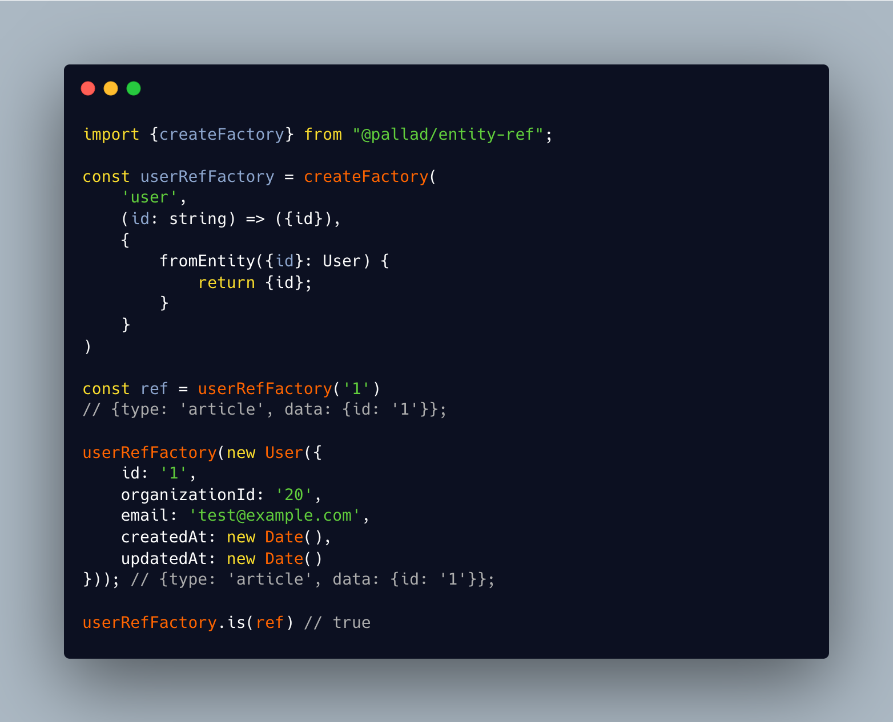

<div align="center">
<h1>Entity-ref 📍</h1>

<p>Create small references to entities</p>
</div>

---
[](https://circleci.com/gh/pallad-ts/entity-ref/tree/master)
[](https://badge.fury.io/js/@pallad%2Fentity-ref)
[](https://coveralls.io/github/pallad-ts/entity-ref?branch=master)
[](https://opensource.org/licenses/MIT)
---



Helper to create consistent entity references used for uniquely identify entity without all its data.

Especially useful if you need to create an address/reference of any kind of entity in places like:

# Use cases

* audit logs
* targeting entities in cascade actions for [`@pallad/cascade`](https://www.npmjs.com/package/@pallad/cascade)
* targeting in ACL
* passing entity reference through messaging channels without sending entire entity
* base for enigmatic IDs

# Community

Join our [discord server](https://discord.gg/mUTCbsC2aD)

# Installation

```shell
npm install @pallad/entity-ref
```

# Usage

The most useful part of this lib is `createFactory` responsible for creating entity ref, adding extra factories and
testing the type.

```typescript
const userRefFactory = createFactory(
		'user', // indicate type name
		(id: string) => ({id}), // main factory that also describes the shape of entity ref data
);

// create ref for given ID
const ref = userRefFactory('1'); // {type: 'user', data: {id: '1'}}
```

## Testing type
You can check if ref is actually a ref for given type using `.is` method.

```typescript
const articleRefFactory = createFactory(
		'article',
		(id: string) => ({id}),
);

const ref = articleRefFactory('1'); // {type: 'article', data: {id: '1'}}

userRefFactory.is(ref) // false
articleRefFactory.is(ref) // true
```

`.is` plays a role of type guard as well.
```typescript
if (articleRefFactory.is(ref)) {
    ref.type // 'article';
	ref.data.id // 👍 typescript knows shape of article refs so no error here
	ref.data.someOtherProperty // ⚠️ this fails
}
```

## Extra factories

Third argument of `createFactory` accepts an object with extra factories in result factory object.

```typescript
class Article {
	readonly id: string;
	readonly title: string;
	readonly createdAt: Date;
	readonly updatedAt: Date;
	readonly authorId: string;

	constructor(data: Article) {
		Object.assign(this, data);
	}
}

const articleRefFactory = createFactory(
		'article',
		(id: string) => ({id}),
		{
			fromEntity({id}: Article) {
				return {id}; // note that it has to return the same data as above
			}
		}
);

articleRefFactory('10');
// {type: 'article', data: {id: '10'}}

articleRefFactory.fromEntity(
		new Article({
			id: '10',
			title: 'Example title',
			createdAt: new Date(),
			updatedAt: new Date(),
			authorId: '20'
		})
);
// {type: 'article', data: {id: '10'}}
```

# Hierarchical data

Storing only main id in entity seems to be useless in many scenarious but lets imagine that every article belongs to organization or workspace so it would be nice to return that information in ref as well.
```typescript
const articleRefFactory = createFactory(
    'article',
    (id: string, workspaceId: string) => ({id, workspaceId}),
    {
        fromEntity({id, workspaceId}: Article) {
            return {id, workspaceId};
        }
    }
);
```

# Examples

## Targeting in ACL
```typescript
import {EntityRef} from "@pallad/entity-ref";

export function hasReadPermission(entityRef: EntityRef<any, any>) {
    if (entityRef.type === 'article') {
        // TODO perform extra checks
    } else if (entityRef.type === 'user') {
        // TODO perform extra checks
    }
    return false;
}

// controller.ts
export default {
    findArticle(id: string) {
        if (!hasReadPermission(articleRefFactory(id))) {
            throw new Error('Insufficient permissions');
        }
        // fetch and return article
    }
}
```

## Audit log

```typescript
import {EntityRef} from "@pallad/entity-ref";

export function articleCreated(article: Article) {
    return entityCreated(articleRefFactory.fromEntity(article));
}

export function entityCreated(ref: EntityRef<any, any>) {
    return createAuditLog({
        name: 'entity.created',
        ref
    });
}
```

## Enigmatic IDs

```typescript
import {EntityRef} from "@pallad/entity-ref";

export function decodeId(id: string): EntityRef<any, {id: string}> {
    const [type, id] = Buffer.from(id, 'base64').toString('utf8').split('-');
    return EntityRef.create(type, {id});
}

export function encodeId(ref: EntityRef<any, {id: string}>) {
    return Buffer.from(`${ref.type}-${ref.data.id}`).toString('base64');
}

encodeId(articleRefFactory('1')) // 'YXJ0aWNsZS0x'
decodeId('YXJ0aWNsZS0x') // {type: 'article', data: {id: '1'}}
```
